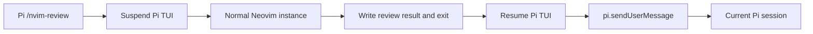

# Native Neovim code review launched from Pi

## Decision

Use one supported entry point:

```text
/nvim-review [git-ref]
```

With no argument, the review compares the working tree with `HEAD`, so staged and unstaged changes are reviewed together. Passing a ref compares against that branch or revision; for example, `/nvim-review main` diffs against `main`.

A companion Pi extension registers that command. The command suspends Pi's TUI, launches a normal interactive Neovim process in the repository, and waits. Neovim collects review comments and returns one structured review batch when the user submits and exits. Pi then resumes its TUI and sends the batch to the current session with `pi.sendUserMessage()`.

There is no independently launched Neovim flow, active-session registry, persistent socket, named pipe, or session picker. The Pi extension that launches Neovim already knows exactly which Pi session owns the review.

`big-diff.nvim` already has most of the editor-side information needed:

- `lua/big-diff/nvim/init.lua` exposes `MiniDiff.get_buf_data()`, including hunks, reference text, and source metadata.
- `lua/big-diff/nvim/hunk.lua` computes hunk ranges and navigation targets.
- `lua/big-diff/nvim/state.lua` owns per-buffer diff state.
- The existing extmark/decorations architecture can display review markers.

The feature should not embed Plannotator's React application. It should borrow the useful concepts—structured line annotations, one combined feedback message, and snapshot awareness—and implement a small native Lua review UI.

## Launch model



The Pi extension must register the command with:

```ts
pi.registerCommand("nvim-review", {
  description: "Review changes against a Git ref in Neovim (default: all uncommitted changes)",
  handler: async (args, ctx) => {
    // Create handoff, suspend TUI, launch Neovim, consume result.
  },
});
```

The command is TUI-only. In RPC, JSON, or print mode it should report that an interactive terminal is required.

### What `nvim -c "BigDiffReviewStart"` means

`-c` asks Neovim to execute an Ex command after normal startup. `BigDiffReviewStart` is not an existing built-in Neovim command; it is a user command that this feature will add.

Conceptually, the extension launches:

```sh
nvim --cmd 'set runtimepath^=/path/to/big-diff.nvim' \
  -c 'BigDiffReviewStart'
```

The implementation must use an argument array rather than constructing this shell string, avoiding quoting and injection problems:

```ts
spawn(nvimExecutable, [
  "--cmd", `set runtimepath^=${escapedPluginRoot}`,
  "-c", "BigDiffReviewStart",
], {
  cwd: repoRoot,
  env: { ...process.env, BIG_DIFF_REVIEW_HANDOFF: handoffPath },
  stdio: "inherit",
});
```

The plugin should define `BigDiffReviewStart` from a small `plugin/` entrypoint or another startup-safe loader. The command reads the private handoff file, initializes the review module, and opens the changed-file or review dashboard.

If the user's configuration already initializes `big-diff.nvim`, review startup must reuse that configuration. It must not call `setup()` a second time or replace the user's mappings. It overrides the diff source only for the requested review target. If the plugin has not been initialized, the review loader may initialize it with defaults plus review-mode settings.

### Preserve the user's Neovim environment and LSP

The launched editor must be a normal Neovim instance:

- do not use `--clean`, `-u NONE`, or a minimal generated init file;
- preserve `process.env`, including `PATH`, language toolchains, and LSP server configuration;
- set Neovim's process working directory to the canonical repository root;
- load the user's normal `init.lua`, plugin manager, filetype plugins, treesitter, and LSP configuration;
- add this checkout to `runtimepath` without replacing the existing runtime path;
- open real repository files in normal listed buffers.

As a result, LSP works exactly as it does in a normal `nvim` launched from that repository. LSP clients attach when review mode opens an actual file buffer. Review list, composer, and dashboard buffers may be scratch buffers and should not expect LSP attachment.

If the user config lazily loads LSP or `big-diff.nvim` based on `BufRead`/`BufEnter`, review startup should open the selected real file through normal Neovim APIs so those events still fire.

### Terminal ownership

The extension must use `ctx.ui.custom()` to obtain TUI access, call `tui.stop()`, and launch Neovim with inherited stdio. It should use asynchronous `spawn()`, not `pi.exec()`:

- `pi.exec()` captures output and does not provide an interactive terminal;
- `spawnSync()` blocks Pi's Node event loop unnecessarily;
- asynchronous `spawn(..., { stdio: "inherit" })` gives Neovim the terminal while allowing orderly process and signal handling.

When Neovim exits, the extension calls `tui.start()` and requests a full render in a `finally` path. Pi remains paused while Neovim owns the same terminal. This is intentional and avoids terminal-emulator-specific window launching.

## Pi-to-Neovim handoff

Before launching Neovim, the extension creates a private temporary directory with user-only permissions and atomically writes `request.json`:

```json
{
  "protocolVersion": 1,
  "requestId": "0194...",
  "token": "random-256-bit-capability",
  "repoRoot": "/canonical/repository/root",
  "piSessionId": "...",
  "piSessionFile": "...",
  "pluginRoot": "/path/to/big-diff.nvim",
  "resultPath": "/private/tmp/.../result.json",
  "reviewStatePath": "/home/user/.local/state/nvim/big-diff/reviews/sha256.json",
  "targetRef": "HEAD",
  "targetDescription": "uncommitted changes (staged and unstaged) compared with HEAD",
  "startedAt": 1770000000000
}
```

Only the handoff path is passed through `BIG_DIFF_REVIEW_HANDOFF`. Neovim validates the protocol, token, repository root, and result location before starting review mode.

No Pi registry or socket is needed. The handoff exists only for the lifetime of this launch and is removed after the extension consumes the result. Stale handoff directories may be cleaned on later launches.

## Proposed user experience

### Start the review

From Pi:

```text
/nvim-review       # staged and unstaged changes compared with HEAD
/nvim-review main  # working tree compared with main
```

Neovim opens in the repository with the user's normal configuration. Review mode initially shows a changed-file picker or dashboard. Selecting a file opens a real file buffer with `big-diff.nvim` hunks visible.

Recommended mappings:

| Mapping | Action |
|---|---|
| `<leader>ar` | Add a review for the hunk or visual selection |
| `<leader>aR` | Open the review list |
| `<leader>as` | Submit the batch and return to Pi |

Equivalent commands must be available:

```vim
:BigDiffReviewAdd
:BigDiffReviewList
:BigDiffReviewSubmit
:BigDiffReviewClear
:BigDiffReviewCancel
```

`BigDiffReviewSubmit` is the terminal action for the launched flow: validate reviews, atomically write the result, and close review mode so control returns to Pi. If modified buffers exist, submission must offer to save or refuse to exit. It must never discard edits.

`BigDiffReviewCancel` exits after confirmation without writing a result. A normal `:qall` without a valid result is also treated as cancellation.

### Add a review

Normal-mode `BigDiffReviewAdd` anchors the comment to the current changed hunk. Visual mode anchors it to selected changed lines. If a selection overlaps more than one hunk, the review stores the exact selected range and every intersecting hunk.

The command opens a centered floating scratch buffer:

```text
Review: lua/big-diff/nvim/init.lua:214-221 [new]
Target: uncommitted changes (staged and unstaged) compared with HEAD

Write the review here...
```

Metadata should be virtual text or nonmodifiable lines. Only the comment body is editable.

| Key | Action |
|---|---|
| `<C-s>` or `:write` | Save the review |
| `<Esc>` | Close; confirm before discarding a changed draft |
| `<C-c>` | Cancel |

A `BufWriteCmd` handler saves the comment without writing the scratch buffer to disk.

### Review markers

Saved reviews are marked in source buffers with a dedicated namespace:

- an `R` sign or configurable sign text;
- optional virtual text such as `review 2`;
- a different highlight for stale reviews.

Review extmarks track ordinary line insertions and deletions while Neovim remains open.

### Review list

`BigDiffReviewList` opens a floating, nonmodifiable list:

```text
● pending  lua/big-diff/nvim/init.lua:214-221 [new]  Handle an empty source...
! stale    lua/big-diff/nvim/viz.lua:88 [new]        This no longer matches...
```

| Key | Action |
|---|---|
| `<CR>` | Jump to the source anchor |
| `e` | Edit the selected review |
| `d` | Delete after confirmation |
| `s` | Submit and return to Pi |
| `r` | Revalidate anchors against the current diff |
| `q` | Close the list |

The list associates rows with review IDs through extmarks or an internal row map. It must not parse IDs from display text.

## Review data model

Use a repository-scoped structured model:

```lua
{
  schema_version = 1,
  id = "review-uuid",
  revision = 1,
  repo_root = "/canonical/repository/root",
  file_path = "lua/big-diff/nvim/init.lua",
  scope = "line",          -- line | file | general
  side = "new",            -- new | old
  line_start = 214,
  line_end = 221,
  ref_line_start = 208,
  ref_line_end = 215,
  source_name = "git",
  source_target = "index",
  selected_text = "...",
  context_before = { "..." },
  context_after = { "..." },
  comment = "Handle the empty source before indexing it.",
  created_at = 1770000000000,
  updated_at = 1770000000000,
  snapshot = {
    ref_hash = "sha256...",
    buffer_hash = "sha256...",
    head = "optional git HEAD",
  },
  status = "pending",      -- pending | submitted | stale
  last_submission_id = nil,
}
```

This is close to Plannotator's annotation shape but is owned by this plugin and does not import Plannotator internals.

### Side selection

Extend normalized sources with optional review metadata such as:

```lua
review_target = { kind = "git-ref", ref = "HEAD" }
```

- Added and changed hunks default to the new side and use buffer line numbers.
- Deleted hunks use the old side and reference-text line numbers.
- A visual selection uses the new side unless it represents a deletion-only hunk.
- If several candidates exist at a row, show a picker.

For an old-side deletion, jumping from the list moves to the nearest real buffer row and displays the existing diff overlay.

### Snapshot and stale-anchor handling

Capture selected text, nearby context, reference and buffer hashes, and Git `HEAD` when available.

On `MiniDiffUpdated`, revalidate pending anchors:

1. Keep the extmark-adjusted range if selected text still matches.
2. Attempt a unique nearby text/context match.
3. Mark the review stale if there is no unique match.

Submission refuses stale reviews and directs the user to the list. Stale reviews are never silently sent.

### Modified buffers

Pi reads files from disk, while Neovim may contain unsaved changes. The default is:

```lua
review = {
  require_saved = true,
}
```

Before submission, offer to save modified buffers referenced by reviews or reject submission. Do not silently send anchors that only match unsaved content. Because submission exits Neovim, also use normal Neovim modified-buffer protections and never force `qall!`.

## Neovim-to-Pi result

On submission, Neovim atomically writes `result.json`:

```json
{
  "protocolVersion": 1,
  "type": "submit-review",
  "requestId": "0194...",
  "token": "random-256-bit-capability",
  "repoRoot": "/canonical/repository/root",
  "reviewCount": 2,
  "reviews": [
    { "id": "review-uuid", "revision": 1 }
  ],
  "markdown": "# Code Review Feedback\n..."
}
```

The result is capped, for example, at 1 MiB and 500 reviews. Neovim writes a temporary file and renames it into place, then exits successfully.

After Neovim exits, the Pi extension:

1. restarts Pi's TUI even if launch or Neovim failed;
2. treats a missing result as cancellation;
3. validates protocol, token, request ID, canonical repository root, UTF-8, count, and size;
4. calls `pi.sendUserMessage(markdown, { deliverAs: "followUp" })` for the current session;
5. records the accepted submission ID with `pi.appendEntry()`;
6. updates the repository review state so exactly the submitted IDs and revisions become `submitted`;
7. removes the private handoff directory.

An edited submitted review increments its revision and returns to `pending` on the next review launch.

There is no cross-session routing ambiguity because only the extension instance handling `/nvim-review` can consume the result.

## Message sent to Pi

The formatter produces concise Markdown with repository-relative paths and exact anchors. It does not include the entire repository diff.

````markdown
# Code Review Feedback

Repository: `/path/to/repository`
Review target: uncommitted changes (staged and unstaged) compared with HEAD
Submission: `0194...`
<!-- big-diff-request-id:0194... -->

Treat these as human review findings. Inspect each finding against the current code. Address confirmed issues and explain any finding you reject. Do not independently review unrelated parts of the diff.

## 1. `lua/big-diff/nvim/init.lua` lines 214-221 (new side)

```lua
local active_source = buf_cache.source[buf_cache.source_id] or {}
active_source.attach(buf_id)
```

> Guard the missing `attach` callback here. A malformed source currently fails with an unrelated nil-call error.
````

The prefix and suffix are configurable. One submission creates one user message and therefore one Pi turn.

## Delivery guarantees

The launched flow has a single handoff rather than a retrying external transport:

- Neovim keeps reviews pending until it atomically writes a valid result.
- Pi validates the result only after Neovim exits.
- The request ID is included in Markdown and persisted with `pi.appendEntry()`.
- Duplicate request IDs are not sent twice.
- Only review IDs and revisions from the accepted result become submitted.
- If Pi fails before accepting the message, reviews remain pending.
- If a hard failure occurs after acceptance but before the receipt is persisted, the next launch reports delivery as unknown and asks the user to inspect the Pi transcript before retrying.

## Persistence

Persist repository review state atomically under Neovim's state directory:

```text
stdpath("state")/big-diff/reviews/<sha256-repo-root>.json
```

Do not write review state into the working tree. Persist annotation records and small excerpts, not the complete diff.

Suggested defaults:

```lua
review = {
  enabled = true,
  persist = true,
  require_saved = true,
  context_lines = 3,
  sign = "R",
  mappings = {
    add = "<leader>ar",
    list = "<leader>aR",
    submit = "<leader>as",
  },
}
```

Writes use a temporary file plus rename. Preserve corrupt state for recovery and report it instead of silently overwriting it.

## Package layout

Keep the editor feature and Pi launcher separate:

```text
plugin/
  big-diff-review.lua

lua/big-diff/nvim/review/
  init.lua
  anchor.lua
  composer.lua
  list.lua
  model.lua
  persistence.lua
  format.lua
  handoff.lua

pi/extensions/
  big-diff-review.ts

package.json
```

The package manifest exposes the Pi extension:

```json
{
  "name": "big-diff.nvim",
  "keywords": ["pi-package"],
  "pi": {
    "extensions": ["./pi/extensions/big-diff-review.ts"]
  },
  "peerDependencies": {
    "@earendil-works/pi-coding-agent": "*"
  }
}
```

A local checkout can be installed into Pi with:

```sh
pi install /Users/searidangpa/.local/share/nvim/site/pack/core/opt/big-diff.nvim
```

The Pi package installation gives the extension a stable way to resolve its own package root. That root is added to the launched Neovim runtime path, so review mode does not depend on the user's plugin manager having installed a second copy.

## Public Lua API

Expose commands through a small API:

```lua
MiniDiff.review.start({ handoff_path = "..." })
MiniDiff.review.add({ buf_id = 0 })
MiniDiff.review.list()
MiniDiff.review.submit()
MiniDiff.review.get_all()
MiniDiff.review.clear({ status = "submitted" })
MiniDiff.review.cancel()
```

Useful user events:

```text
User BigDiffReviewUpdated
User BigDiffReviewSubmitted
User BigDiffReviewCancelled
User BigDiffReviewDeliveryFailed
```

## Scope of the first release

The first release supports:

- launch only through Pi's `/nvim-review` command;
- a normal Neovim environment with the user's LSP and editor configuration;
- current saved working-tree files versus `HEAD` by default, including staged and unstaged changes;
- an optional branch or revision argument such as `/nvim-review main`;
- custom reference sources after source metadata exposes the exact target;
- a changed-file picker;
- comments on changed lines and hunks;
- local persistence, list/edit/delete/jump;
- one-batch return to the launching Pi session.

Initial non-goals:

- launching review mode from an independent existing Neovim process;
- session registries, sockets, named pipes, or multi-session selection;
- GitHub PR or GitLab MR retrieval/posting;
- a browser UI;
- JJ, GitButler, Perforce, and stacked-PR semantics;
- AI-generated review agents;
- suggestions that directly edit or stage code;
- image attachments;
- remote-session transport.

## Implementation phases

### Phase 1: Pi launch and handoff

1. Add the Pi package manifest and companion extension.
2. Register `/nvim-review`.
3. Resolve the canonical repository and plugin roots.
4. Create the private request/result handoff.
5. Suspend and reliably restore Pi's TUI.
6. Launch normal Neovim with inherited stdio, environment, user config, and repository cwd.
7. Add the startup-safe `BigDiffReviewStart` command.
8. Handle cancellation, process errors, signals, and cleanup.

### Phase 2: native reviews

1. Add review configuration and commands.
2. Extend normalized sources with review-target metadata.
3. Add a changed-file picker.
4. Implement hunk and visual-selection anchor capture.
5. Implement the composer and review list.
6. Add repository persistence, markers, and stale detection.
7. Implement deterministic Markdown formatting.
8. Atomically write a validated result and exit review mode.

### Phase 3: Pi delivery

1. Validate the returned result after Neovim exits.
2. Send exactly one user message to the launching session.
3. Persist request-ID deduplication.
4. Mark exactly the accepted review revisions as submitted.
5. Represent ambiguous hard failures as delivery unknown.

## Testing

### Lua tests

- startup handoff validation;
- normal user config and runtime path coexistence;
- changed-file selection opens normal listed file buffers;
- hunk mapping for add/change/delete;
- visual ranges crossing hunks;
- old-side and new-side line numbers;
- extmark movement and stale re-anchoring;
- persistence migration and corrupt-file recovery;
- deterministic Markdown and result output;
- modified buffers prevent unsafe submission;
- submitted revisions are marked exactly.

### Pi extension tests

- command rejects non-TUI modes;
- Neovim receives canonical repository cwd and inherited environment;
- TUI stops before launch and restarts on success, cancellation, spawn error, signal, and invalid result;
- argument arrays prevent shell injection;
- missing result is cancellation;
- invalid token, request ID, repository, protocol, UTF-8, and oversized results are rejected;
- exactly one combined message reaches the current session;
- duplicate request IDs do not duplicate delivery;
- temporary handoff data is removed.

### End-to-end test

Run Pi's command against a temporary Git repository and a test Neovim configuration containing a fake LSP attachment marker. Create two comments, submit, and assert:

1. Neovim loaded the test user configuration and opened real file buffers;
2. the LSP attachment path was exercised;
3. exactly one combined message was delivered;
4. paths, sides, ranges, excerpts, and comments are correct;
5. acknowledged revisions became submitted;
6. cancellation sends nothing;
7. Pi's TUI is restored after every exit path.

## Acceptance criteria

The feature is ready when:

- `/nvim-review` launches a full interactive Neovim in the same terminal.
- The user's normal Neovim configuration, filetype behavior, and LSP continue to work.
- Pi's TUI always resumes after Neovim exits or fails.
- A user can browse changed files and add comments without leaving Neovim.
- Reviews survive closing and reopening review mode.
- Stale anchors are visible and cannot be submitted.
- Submission safely saves or rejects modified buffers.
- Submitting exits review mode and sends one message to the exact Pi session that launched it.
- Cancellation sends nothing.
- Failed or ambiguous delivery loses no review data.

## Recommendation

Implement the Pi-launched flow only. It is simpler and safer than discovering an already-running Pi session, guarantees correct session ownership, and still gives Neovim a complete native environment—including the user's LSP—because Pi launches a normal Neovim process rather than a reduced or embedded editor.

## End-to-end testing with tmux

Use a dedicated tmux session as the end-to-end harness. tmux provides a real interactive PTY while allowing the test to start Pi detached, send keystrokes, capture terminal output, and cleanly tear down the process tree. This tests the actual terminal handoff rather than a mocked `spawn()` call.

The test must run Pi in its normal interactive mode, not print, JSON, or RPC mode. It should start Pi in the same tmux pane that Neovim will later inherit. The extension must stop Pi's TUI, launch Neovim with inherited stdio, wait for Neovim to exit, and restart Pi's TUI in that same pane. Do not launch Neovim in a separate tmux pane or window; that would not test the intended terminal ownership model.

Use an isolated tmux socket and configuration so the test does not modify or depend on the user's tmux server:

```sh
cat > "$tmp/tmux.conf" <<'EOF'
set -g extended-keys on
set -g extended-keys-format csi-u
EOF

tmux -L "$socket" -f "$tmp/tmux.conf" \
  new-session -d \
  -s review-e2e \
  -x 140 -y 45 \
  -c "$fixture_repo" \
  pi --no-session
```

The fixture should contain:

- a temporary Git repository with a committed file and deterministic working-tree changes;
- a temporary normal Neovim configuration selected through `XDG_CONFIG_HOME` or `NVIM_APPNAME`;
- a fake LSP server or test LSP configuration that writes a marker from `LspAttach`;
- the installed Pi package or explicitly loaded extension under test;
- a deterministic Pi model/provider, or a session file that can be inspected without requiring a network model.

Drive the review through the real UI with `tmux send-keys`. Wait for visible readiness or handoff files between steps rather than using fixed sleeps. A successful case should:

1. start Pi in the fixture repository;
2. submit `/nvim-review`;
3. verify that Neovim loaded the test configuration and opened a real listed file buffer;
4. verify that the LSP attachment marker was written;
5. add two comments through the review commands or mappings;
6. submit the batch;
7. verify that Neovim exited and Pi's TUI was restored;
8. inspect the result and Pi session data.

Assertions must cover both terminal state and durable artifacts:

- exactly one combined user message reaches the launching Pi session;
- the message contains the correct repository-relative paths, sides, ranges, excerpts, and comments;
- only the acknowledged review IDs and revisions become `submitted`;
- the handoff directory is removed after acceptance or cancellation;
- cancellation writes no result and sends no user message;
- the normal Neovim configuration, filetype behavior, environment, and LSP path were exercised;
- Pi's TUI is restored after successful submission, cancellation, spawn failure, invalid results, and Neovim termination by signal.

Use `tmux capture-pane -p -J` for diagnostic output, but do not make screen scraping the only assertion. Validate result JSON, review persistence, session JSONL, and test marker files directly. Keep handoff protocol, token, UTF-8, size, duplicate-delivery, and stale-anchor cases in focused Lua or Pi extension tests; tmux should cover the cross-process interactive behavior.
